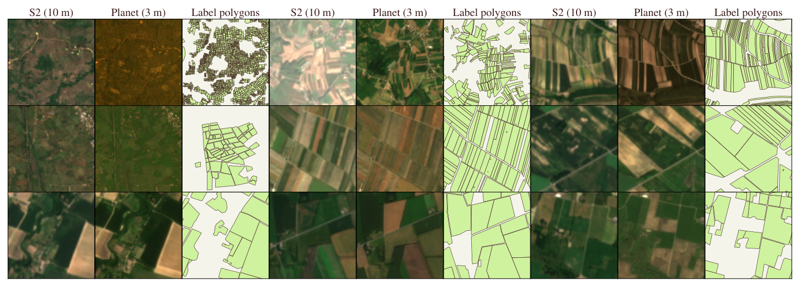

<div align="center">
<h1>Fields of the Planet</h1>
<h3>Field Boundary Mapping Beyond 10 Meters</h3>

**[Isaac Corley](https://isaac.earth)** · **[Caleb Robinson](https://calebrob.com/)** · **Jennifer Marcus** · **[Hannah Kerner](https://hannah-rae.github.io/)**

<a href="https://arxiv.org/abs/2607.04449"></a>
<a href="https://huggingface.co/datasets/taylor-geospatial/ftw-planet"></a>
<a href="https://huggingface.co/taylor-geospatial/ftp-b3"></a>
<a href="https://huggingface.co/taylor-geospatial/ftp-b7"></a>
<a href="https://taylor-geospatial.github.io/fields-of-the-planet/"></a>
<a href="LICENSE"></a>

</div>

**Fields of the Planet (FTP) pairs every Fields of The World (FTW) Sentinel-2 patch with a co-registered 3 m PlanetScope image, so models predict field boundaries at 3 m instead of 10 m.** Two seasonal windows per patch (planting and harvest) across 24 countries / 25 labeled regions.

<p align="center">
    <br/>
    <b>Figure 1.</b> Each row pairs a Fields of The World Sentinel-2 patch at 10 m with the co-registered PlanetScope image at 3 m and the ground-truth field-boundary polygons.
</p>

## Install

```bash
make install        # uv sync --all-extras
```

This installs the `ftw-planet` command. Run all commands from the repository
root. Stack: Python 3.13, [uv](https://docs.astral.sh/uv/), PyTorch Lightning.

## Reproducing training and evaluation

Assumes a machine with one CUDA GPU and the dataset already present under
`data/` (see [Dataset](#dataset)).

### 1. Check the data

```bash
ftw-planet check-data --split dense10
```

Confirms `data/planet/<country>/` exists for the evaluation countries and
prints the expected layout if anything is missing.

### 2. Evaluate the released checkpoint

```bash
ftw-planet reproduce --ckpt logs/best_checkpoints/planet_efnet3_augmax_full_best.ckpt
```

Runs watershed + D4 TTA inference over the ten dense-label held-out countries,
writes `logs/eval/<checkpoint>/metrics.csv` (one row per country), and prints
the macro table next to the published numbers:

| Metric          | Expected |
| --------------- | -------- |
| PQ              | 0.355    |
| Obj F1 (WS+TTA) | 0.452    |
| Pixel IoU       | 0.688    |

Presence-only Kenya is excluded from these aggregates; pass `--split full23`
for the 23-region full-data protocol.

### 3. Train from scratch

```bash
ftw-planet train configs/ftw_planet_efnet3_512_prueplus.yaml
```

Trains the EfficientNet-B3 U-Net with the PRUE+ recipe (seed 7). Checkpoints
land under `logs/prue/<run>/`. Resume with `--resume <last.ckpt>`. To train and
immediately evaluate:

```bash
ftw-planet reproduce \
  --train configs/ftw_planet_efnet3_512_prueplus.yaml \
  --ckpt logs/prue/<run>/checkpoints/last.ckpt
```

## Models

`configs/` holds the four reported models, each a U-Net with an EfficientNet
encoder trained via `ftw model fit`:

| Config                                | Sensor          | Backbone                     |
| ------------------------------------- | --------------- | ---------------------------- |
| `ftw_planet_efnet3_512_prueplus.yaml` | PlanetScope 3 m | EfficientNet-B3 (main model) |
| `ftw_planet_efnet7_512_prueplus.yaml` | PlanetScope 3 m | EfficientNet-B7              |
| `ftw_s2_efnet3_256_prueplus.yaml`     | Sentinel-2 10 m | EfficientNet-B3 (baseline)   |
| `ftw_s2_efnet7_256_prueplus.yaml`     | Sentinel-2 10 m | EfficientNet-B7 (baseline)   |

## Evaluation

Models are scored as parcel-recovery systems on **vectorized** predictions, not
pixel maps. `ftw-planet eval` runs a single watershed + D4 TTA inference pass
per patch and reports panoptic quality (PQ/SQ/RQ), object F1 over the COCO IoU
grid, and meter-scale matched-boundary error. Pixel IoU is reported only for
continuity.

## Dataset

FTP is published on Hugging Face (`taylor-geospatial/ftw-planet`) and Source
Cooperative (`s3://us-west-2.opendata.source.coop/ftw/ftw-planet/`):

- **66,584 patches** (two seasonal windows each = 133,168 image-window pairs)
    across 24 countries / 25 labeled regions, drawn from the 70,484 labeled FTW
    patches.
- **Imagery:** PlanetScope `ortho_analytic_4b_sr`, 4 bands (B/G/R/NIR), ~3 m
    GSD, native UTM, `uint16` (reflectance = DN / 10000).
- **Labels:** 3-class raster — 0 background, 1 field interior, 2 field boundary
    (`uint8`). The original FTW vector polygons ship alongside as GeoParquet.

The release is one WebDataset tar per region (25 shards, ~94 GiB) plus a
GeoParquet `index.parquet` (one row per patch). Each patch has five members:

```
<pid>.window_a.tif        PlanetScope SR, planting window
<pid>.window_b.tif        PlanetScope SR, harvest window
<pid>.label.tif           3-class label
<pid>.polygons.parquet    original FTW field polygons, clipped to the patch
<pid>.json                per-patch metadata
```

For local training/eval, extract each tar into `data/planet/<country>/` so a
patch resolves as `data/planet/<country>/window_{a,b}/<pid>.tif` with labels
under `data/planet/<country>/labels/`. `ftw-planet check-data` validates the
layout.

## Citation

```bibtex
@inproceedings{corley2026ftp,
  title         = {Fields of the Planet: Field Boundary Mapping Beyond 10m},
  author        = {Corley, Isaac and Robinson, Caleb and
                   Marcus, Jennifer and Kerner, Hannah},
  year          = {2026},
  eprint        = {2607.04449},
  archivePrefix = {arXiv},
  primaryClass  = {cs.CV}
}
```

## License / data terms

Code: MIT (see `LICENSE`). Imagery is © Planet Labs PBC (non-commercial terms);
FTW polygons are CC-BY-4.0 — see `fieldsoftheworld/ftw-baselines` for source
terms.
